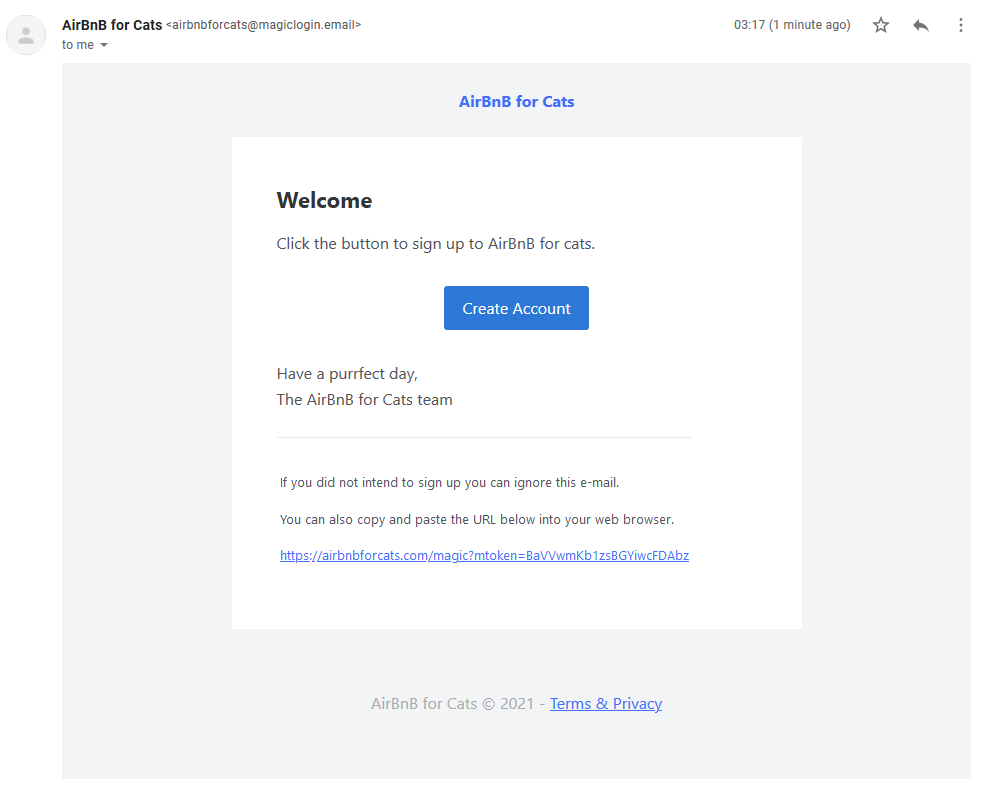

# Sending your first e-mail

## Introduction

This guide will run you through sending your first e-mail that contains an **action**. An **action** is a button \(or really a link\) inside your e-mail, such as **"Click to sign up to AirBnB for Cats"**.You send e-mails in Magic Login through a JSON HTTP API. 

Let's look at an example API request to the SendTemplateEmail endpoint:


Where possible, Magic Login's API supports **Markdown**.


```javascript
{
    "from": "AirBnB for Cats <airbnbforcats@magiclogin.email>",
    "reply_to": "Cat Jones <cat@airbnbforcats.com>",
    "to": "tabby@ilovecats.com",
    "subject": "Please verify your e-mail to sign up",
    
    "content": {
        "main": "# Welcome\nClick the button to sign up to AirBnB for cats.",
        "action": {
            "name": "Create Account",
            "url": `https://airbnbforcats.com/magic`,
            "purpose": "signup",
        },
        "outro": "Have a purrfect day,\nThe AirBnB for Cats team",
        "sub": "If you did not intend to sign up you can ignore this e-mail.",
        "footer": "AirBnB for Cats © 2021 - [Terms & Privacy](https://airbnbforcats.com/terms)"
    }
}
```



## **Making the actual request**

We will make a HTTP **POST** request to**`https://api.magiclogin.net/<YOUR-APP-ID>/v1/sendTemplateEmail`**.

To authenticate you are required to send a header with name **`Authorization`** and value`Bearer <YOUR-API-TOKEN>`.


Replace `<YOUR-APP-ID>` with the **Application ID** and replace `<YOUR-API-TOKEN>`by the **API Token** we created during [**setup**](setting-up.md#creating-an-application)**.**

Reminder: the API Token is a secret, don't put it in your front-end code. You should only make requests to the Magic Login API from your server backend, never your front-end client.


You will be able to make this request from any programming language, here's a **Node.js** example that uses the popular **axios** library:

```javascript
const axios = require("axios");

const apiToken = "apitoken_secretsecretsecretsecret";
const appID = "app_eXAmple";

const url = `https://api.magiclogin.net/v1/${appID}/sendTemplateEmail`;
const headers = {
  "Authorization": `Bearer ${apiToken}`
};
const body = {
    "from": "AirBnB for Cats <airbnbforcats@magiclogin.email>",
    "reply_to": "Cat Jones <cat@airbnbforcats.com>",
    "to": "tabby@ilovecats.com",
    "subject": "Please verify your e-mail to sign up",
    "content": {
        "main": "# Welcome\nClick the button to sign up to AirBnB for cats.",
        "action": {
            "name": "Create Account",
            "url": `https://airbnbforcats.com/magic`,
            "purpose": "signup",
        },
        "outro": "Have a purrfect day,\nThe AirBnB for Cats team",
        "sub": "If you did not intend to sign up you can ignore this e-mail.",
        "footer": "AirBnB for Cats © 2021 - [Terms & Privacy](https://airbnbforcats.com/terms)"
    }
}

axios.post(url, body, {headers: headers})
  .then(response => {
    console.log(`status: ${response.status}`)
    console.log(response.data)
  })
  .catch(error => {
    console.log(error);
    console.error(`Something went wrong: ${JSON.stringify(error.response.data)} (status ${error.response.status})`)
  });
```

When we run above code, it prints:

```text
status: 200
{
  success: true,
  data: {
    email: {
      from: 'AirBnB for Cats <airbnbforcats@magiclogin.email>',
      reply_to: 'Cat Jones <cat@airbnbforcats.com>',
      to: 'tabby@ilovecats.com',
      id: '01020177a8dc234d-51955b92-546f-4da8-9e28-3e7a8eb411ea-000000'
    },
    token_id: 'GdyU4bHKeRDYxjrn7y4Fk576HHDpCLyaoNYRUgAtKKGf'
  }
}
```

That's it! We just sent our first e-mail using the Magic Login API 🎉. For more details check out the API page on Sending Emails:



## What happens now?

Our recipient **tabby@ilovecats.com** will have received an e-mail with a big button that says **Create Account**. This button links to something like **`https://airbnbforcats.com/magic?mtoken=9nwTWNkNDG1TgwaNzVAt3t`**.  
  
This **mtoken** query parameter automatically got added to the URL. This is a secret token that we will verify in the next guide, which will allow us to **authenticate** the recipient of the e-mail.


